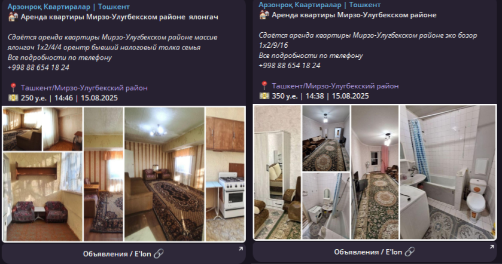

# OLX Parser



## Architecture

```bash
src/
├── core/                   # Core business logic and configuration
│   ├── config.py           # Application configuration and constants
│   ├── models.py           # Pydantic data models with full typing
│   └── app_factory.py      # Dependency injection factory
├── services/               # Business logic services
│   ├── olx_service.py      # Main OLX scraping logic
│   ├── telegram_service.py # Telegram bot messaging
│   └── image_service.py    # Image processing and collages
├── adapters/               # External service adapters
│   └── database.py         # Database interface and SQLite implementation
└── utils/                  # Utility functions
    └── logging_utils.py    # Logging configuration
```

## Installation

1. **Clone and setup the project:**

   ```bash
   python -m venv .venv
   ```

   ```bash
   .venv\Scripts\activate  # Windows
   ```

   ```bash
   source .venv/bin/activate  # Linux/Mac
   ```

2. **Install dependencies:**

   ```bash
   pip install -r requirements.txt
   ```

3. **Configure your Telegram bot:**
   - Rename `sample.env` to `.env` with your bot token and channel ID
   - And set environment variables
   - Windows (PowerShell):
     - `$env:TELEGRAM_BOT_TOKEN=YOUR_TOKEN`
     - `$env:TELEGRAM_CHANNEL_ID=YOUR_CHANNEL_ID`
   - Windows (Command Prompt):
     - `set TELEGRAM_BOT_TOKEN=YOUR_TOKEN`
     - `set TELEGRAM_CHANNEL_ID=YOUR_CHANNEL_ID`
   - Linux/Mac:
     - `export TELEGRAM_BOT_TOKEN=YOUR_TOKEN`
     - `export TELEGRAM_CHANNEL_ID=YOUR_CHANNEL_ID`

## Usage

## Configuration

Key configuration options in `src/core/config.py`:

- `SCHEDULER_INTERVAL_MINUTES`: Scraping frequency
- `SEARCH_PARAMS`: OLX search criteria

```py
SEARCH_PARAMS = {
      "offset":      0,
      "limit":       50,    # Results per page
      "category_id": 1147,  # Real estate category ID
      "region_id":   5,     # Tashkent region ID
      "district_id": 26,    # Tashkent district ID
      "city_id":     5,     # Tashkent city ID
      "distance":    10,    # Radius in km
      "currency": "UYE",    # Currency UZS/UYE
      "sort_by": "created_at:desc",
      "filter_float_price:from": 100,  # Min. price
      "filter_float_price:to":   300,  # Max. price
      "filter_float_number_of_rooms:from": 1,  # Min. rooms
      "filter_float_number_of_rooms:to":   6,  # Max. rooms
      "filter_refiners": "",
  }
```

### Run the application

```bash
python app.py
```
